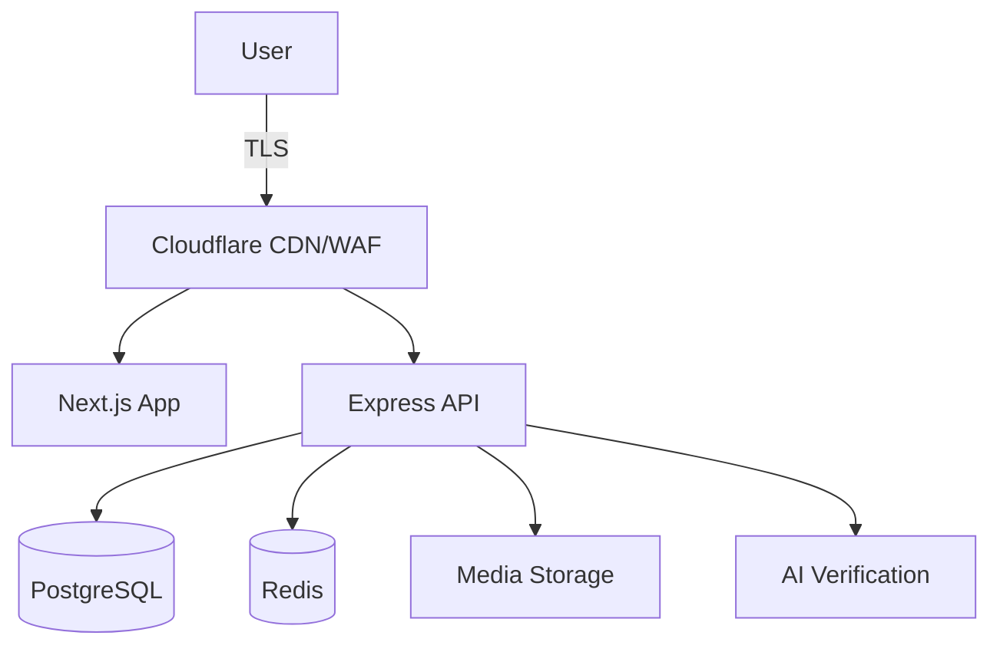

# Daadaar Platform - Architectural Overview

This document serves as the high-level entry point for the Daadaar Platform architecture. For detailed technical specifications, please refer to our [Architecture Documentation Suite](./docs/architecture/README.md).

## Executive Summary

Daadaar is a decentralized platform designed to visualize and expose institutional injustices through:
1. **Community-Driven Reporting**: Anonymous and secure submission of claims.
2. **Graph Visualization**: Interactive mapping of organizations, roles, and individuals.
3. **AI-Powered Verification**: Algorithmic confidence scoring for data integrity.

## Core Pillars

### 1. Privacy & Anonymity
We prioritize user safety through an anonymous-first design. We do not track IP addresses, andparticipation does not require registration.

### 2. VPN-Friendly Security
Traditional IP-based rate limiting is replaced by **Session-based limits** and **Proof-of-Work (PoW)** challenges, ensuring accessibility for users in high-censorship regions.

### 3. Scalable Micro-Architecture
The platform utilizes a separated frontend (Next.js) and backend (Express.js) architecture, allowing for independent scaling and specialized optimization.

## Strategic Documentation

| Document | Purpose |
| :--- | :--- |
| 🏛️ [**Main Architecture Guide**](./docs/architecture/README.md) | Entry point for all technical design. |
| 🖥️ [**Frontend Systems**](./docs/architecture/frontend.md) | Next.js, React Flow, and i18n strategy. |
| ⚙️ [**Backend & API**](./docs/architecture/backend.md) | Node.js runtime, Auth middleware, and Job queues. |
| 📊 [**Data Persistence**](./docs/architecture/data.md) | PostgreSQL schema, Drizzle ORM, and S3 storage. |
| 🛡️ [**Security Framework**](./docs/architecture/security.md) | PoW, CSRF, and Moderation systems. |
| ☁️ [**Infrastructure**](./docs/architecture/infrastructure.md) | AWS, Cloudflare, and CI/CD. |
| 🚀 [**Roadmap**](./docs/architecture/roadmap.md) | Development phases and recent milestones. |

---

## High-Level Architecture

---
*Last Updated: January 4, 2026*
