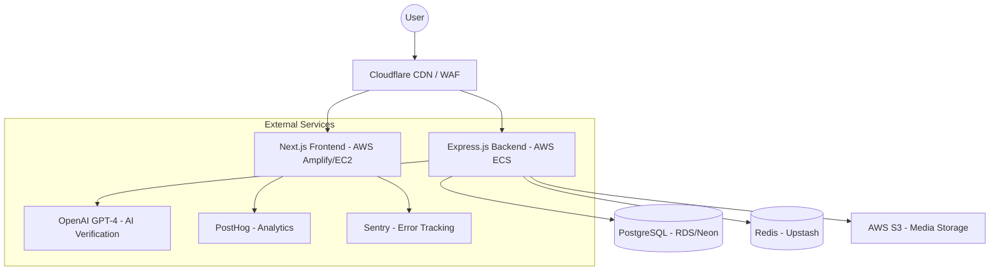

# Architecture Documentation

Welcome to the Daadaar Platform Architecture documentation. This suite of documents provides a comprehensive overview of the system's design, engineering principles, and implementation strategies.

## Executive Summary

Daadaar is a decentralized, anonymous platform designed to expose institutional injustices through community-driven reporting, graph-based visualization, and AI-powered verification. The platform prioritizes **privacy**, **VPN compatibility**, and **transparency**.

### Core Architecture Highlights
- **Separated Frontend-Backend**: Optimized for independent scalability and specialized performance.
- **Privacy-First Design**: Anonymous participation by default with optional registered identity.
- **VPN-Friendly Security**: Rate limiting driven by sessions and Proof-of-Work (PoW) rather than IP addresses.
- **Graph-Centric Data**: Visualizing complex relationships between organizations, roles, and individuals.

---

## Documentation Map

To navigate the architecture, please refer to the following specialized documents:

### 🏛️ [Core Architecture](README.md)
Executive summary, high-level diagrams, and fundamental design principles.

### 🖥️ [Frontend Architecture](frontend.md)
Next.js 16 (App Router), React Flow visualization, i18n strategy (Persian-first), and the custom design system.

### ⚙️ [Backend & API](backend.md)
Express.js runtime, unified authentication middleware, type-safe API contracts, and background job processing.

### 📊 [Data & Persistence](data.md)
PostgreSQL schema design, Drizzle ORM, indexing strategy, and multi-tier storage (S3 + Redis).

### 🛡️ [Security & Privacy](security.md)
Multi-layered defense: Proof-of-Work, CSRF protection, session-based rate limiting, and the banning/moderation system.

### ☁️ [Infrastructure & DevOps](infrastructure.md)
AWS deployment (ECS, RDS, S3), Cloudflare CDN integration, and monitoring (Sentry, PostHog).

### 🚀 [Roadmap & Task Management](roadmap.md)
Development phases, project milestones, and recent improvements.

---

## High-Level System Design

## Engineering Principles

1. **Privacy by Default**: We do not track IP addresses. Anonymity is a feature, not a bug.
2. **Computational Cost as Deterrent**: We use PoW to prevent automated abuse, ensuring the platform remains open without requiring invasive KYC.
3. **Type-Safety Across the Stack**: From Drizzle models to shared API types and React props.
4. **Performance at Scale**: Use of indexes, caching, and AVIF image optimization to maintain a premium experience even under high load.
5. **Internationalization (i18n)**: Native RTL support with Persian as the primary source of truth.

---
*Last Updated: January 2026*
